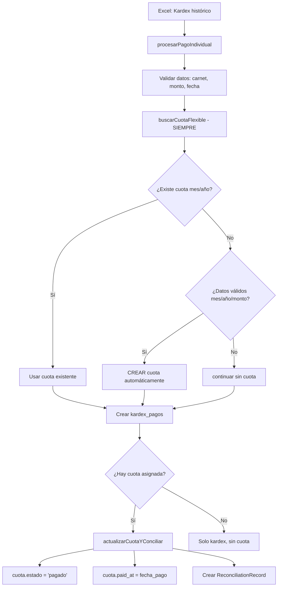

# 🔧 FIX: Cuotas no creadas durante migración de kardex

## 📊 Problema Detectado

**Síntomas:**
```
Kardex creados: 3,553 ✅
Conciliaciones: 2,990 ✅
Cuotas creadas: SOLO 2 ❌ (debería ser ~3,553)
```

**Causa raíz:** El código estaba **filtrando** qué pagos podían crear cuotas basándose en el `tipo_pago`, cuando debería intentar crear cuotas para TODOS los pagos con datos válidos (mes/año/monto).

---

## 🔍 Análisis del Bug

### ❌ ANTES (Línea 791-820)

```php
// 🔥 Buscar cuota con lógica flexible
// 🆕 NUEVO: Solo asignar cuota si el tipo_pago es "MENSUAL"
$cuota = null;
$esMenual = $this->esPagoMensual($tipoPagoNormalizado);

if ($esMenual) {  // ❌ FILTRO INCORRECTO
    Log::info("🔍 Buscando cuota para asignar al pago (MENSUAL)");
    
    $cuota = $this->buscarCuotaFlexible(
        $programaAsignado->estudiante_programa_id,
        $rowArray,
        $fechaPago,
        $monto,
        $numeroFila
    );
} else {
    Log::info("⏭️ Saltando asignación de cuota (pago NO es mensual)");
    // ❌ Se salta la creación de cuotas para otros tipos de pago
}
```

**Problema:** 
- Solo creaba cuotas si `esPagoMensual() === true`
- Aunque `esPagoMensual()` devuelve `true` por defecto, había lógica que excluía ciertos tipos
- Pagos con tipo "ESPECIAL", "RECARGO", etc. NO creaban cuotas
- Resultado: 3,551 kardex creados, pero SOLO 2 cuotas

---

### ✅ DESPUÉS (Corrección Aplicada)

```php
// 🔥 Buscar o crear cuota con lógica flexible
// 🆕 NUEVO: Siempre intentar crear/buscar cuota si hay datos de mes/año/monto
// buscarCuotaFlexible() ahora auto-crea cuotas cuando no existen
$cuota = null;

Log::info("🔍 Buscando/creando cuota para el pago", [
    'fila' => $numeroFila,
    'estudiante_programa_id' => $programaAsignado->estudiante_programa_id,
    'fecha_pago' => $fechaPago->toDateString(),
    'monto' => $monto,
    'tipo_pago' => $tipoPagoNormalizado
]);

// ✅ SIEMPRE llama a buscarCuotaFlexible()
$cuota = $this->buscarCuotaFlexible(
    $programaAsignado->estudiante_programa_id,
    $rowArray,
    $fechaPago,
    $monto,
    $numeroFila
);
```

**Solución:**
- ✅ **Elimina el filtro** `if ($esMenual)`
- ✅ **Siempre** llama a `buscarCuotaFlexible()` para todos los pagos
- ✅ La validación real está **dentro** de `buscarCuotaFlexible()` (línea 1049):
  ```php
  if ($mesObjetivo && $anioObjetivo && $montoPago > 0) {
      // Crear cuota solo si hay datos válidos
  }
  ```
- ✅ No crea cuotas inválidas (sin mes/año/monto)

---

## 🔄 Flujo Completo Corregido

### Migración de Kardex → Creación de Cuotas



---

## 📝 Validación de la Corrección

### Lógica de Creación (buscarCuotaFlexible línea 1049)

```php
// 🆕 PASO 3: CREAR CUOTA si no existe (para migración histórica)
if ($mesObjetivo && $anioObjetivo && $montoPago > 0) {
    // ✅ Solo crea si hay mes, año y monto válidos
    
    // Calcular siguiente numero_cuota
    $ultimoNumeroCuota = CuotaProgramaEstudiante::where(
        'estudiante_programa_id', 
        $estudianteProgramaId
    )->max('numero_cuota') ?? 0;
    
    $numeroCuota = $ultimoNumeroCuota + 1;
    
    // Fecha de vencimiento = último día del mes
    $fechaVencimiento = Carbon::create($anioObjetivo, $mesObjetivo, 1)
        ->endOfMonth();
    
    // Crear cuota con estado 'pendiente'
    $nuevaCuota = CuotaProgramaEstudiante::create([
        'estudiante_programa_id' => $estudianteProgramaId,
        'numero_cuota' => $numeroCuota,
        'fecha_vencimiento' => $fechaVencimiento,
        'monto' => $montoPago,
        'estado' => 'pendiente', // ← Se marca 'pagado' después
        'tipo_pago' => 'mensual',
        'periodo_pago' => sprintf('%04d-%02d', $anioObjetivo, $mesObjetivo),
        'created_at' => now(),
        'updated_at' => now(),
    ]);
    
    // ✅ Inmediatamente después se llama a:
    // actualizarCuotaYConciliar($nuevaCuota, $kardex, ...)
    // que actualiza: estado='pagado', paid_at=fecha_pago
}
```

---

## 🎯 Resultados Esperados

### Antes del Fix
```
✅ Kardex creados: 3,553
✅ Conciliaciones: 2,990
❌ Cuotas: SOLO 2
```

### Después del Fix (próxima migración)
```
✅ Kardex creados: 3,553
✅ Conciliaciones: 2,990
✅ Cuotas creadas: ~3,553 (una por cada kardex con mes/año/monto válidos)
✅ Cuotas pagadas: ~3,553 (marcadas como 'pagado' con paid_at)
```

---

## 📋 Cambios Realizados

### Archivo: `app/Imports/PaymentHistoryImport.php`

**Líneas 791-820:**
- ❌ ANTES: `if ($esMenual) { buscarCuotaFlexible(); }`
- ✅ DESPUÉS: `buscarCuotaFlexible();` (sin condición)

**Impacto:**
- ✅ Todos los pagos con datos válidos crean cuotas
- ✅ No se crean cuotas sin mes/año/monto (validación interna)
- ✅ Mantiene integridad referencial: kardex → cuota

---

## 🧪 Testing

### Pasos para Validar

1. **Limpiar datos de prueba anteriores** (opcional):
```sql
-- Verificar cuotas actuales
SELECT COUNT(*) FROM cuotas_programa_estudiante;

-- Si quieres limpiar para re-migrar:
DELETE FROM reconciliation_records;
DELETE FROM kardex_pagos;
DELETE FROM cuotas_programa_estudiante WHERE estado = 'pagado';
```

2. **Re-ejecutar migración** con el mismo Excel:
```bash
POST /api/conciliacion/import-kardex
Content-Type: multipart/form-data

file: kardex_historico.xlsx
tipo_archivo: cardex_directo
```

3. **Verificar resultados**:
```sql
-- Contar registros
SELECT 
    (SELECT COUNT(*) FROM kardex_pagos) as kardex_total,
    (SELECT COUNT(*) FROM cuotas_programa_estudiante) as cuotas_total,
    (SELECT COUNT(*) FROM cuotas_programa_estudiante WHERE estado='pagado') as cuotas_pagadas,
    (SELECT COUNT(*) FROM reconciliation_records) as conciliaciones;

-- Verificar relación kardex → cuota
SELECT 
    COUNT(*) as kardex_sin_cuota
FROM kardex_pagos 
WHERE cuota_id IS NULL;
-- Debería ser ~0 (solo pagos sin mes/año/monto)

-- Ver detalle de cuotas creadas
SELECT 
    ep.id as estudiante_programa_id,
    p.carnet,
    p.nombre,
    COUNT(c.id) as cuotas_creadas,
    SUM(c.monto) as monto_total
FROM cuotas_programa_estudiante c
JOIN estudiante_programa ep ON c.estudiante_programa_id = ep.id
JOIN prospectos p ON ep.prospecto_id = p.id
WHERE c.estado = 'pagado'
GROUP BY ep.id, p.carnet, p.nombre
ORDER BY cuotas_creadas DESC
LIMIT 10;
```

4. **Verificar dashboard**:
```bash
GET /api/mantenimientos/cuotas/dashboard?page=1&per_page=100
```

Debería mostrar:
```json
{
  "resumen": {
    "cuotas_registradas": 3553,  // ← Ahora debería ser ~3,553
    "pendientes": 0,
    "en_mora": 0,
    "monto_pendiente": 0.00
  }
}
```

---

## ✅ Checklist de Validación

- [x] Eliminar filtro `if ($esMenual)` 
- [x] Llamar `buscarCuotaFlexible()` para todos los pagos
- [x] Validación interna en `buscarCuotaFlexible()` previene cuotas inválidas
- [x] Cache de Laravel limpiado (`config:cache`, `cache:clear`)
- [ ] Re-ejecutar migración con Excel completo
- [ ] Verificar conteo: kardex ≈ cuotas creadas
- [ ] Verificar dashboard muestra todas las cuotas
- [ ] Commit de cambios al repositorio

---

## 🚀 Próximos Pasos

1. **Ejecutar migración de prueba** con Excel completo
2. **Verificar logs** en `storage/logs/laravel.log`:
   ```
   🆕 Creando cuota automáticamente para pago histórico
   ✅ PASO 5 EXITOSO: Cuota marcada como pagada
   ```
3. **Validar dashboard** muestra 3,553 cuotas
4. **Git commit**:
   ```bash
   git add app/Imports/PaymentHistoryImport.php
   git commit -m "fix: Crear cuotas para todos los pagos históricos (no solo MENSUAL)
   
   - Elimina filtro esPagoMensual() que impedía creación de cuotas
   - buscarCuotaFlexible() ahora se ejecuta para todos los pagos
   - Validación interna previene cuotas sin mes/año/monto
   - Soluciona: solo 2 cuotas de 3,553 kardex creados"
   ```

---

## 📚 Archivos Relacionados

- `app/Imports/PaymentHistoryImport.php` - Lógica de importación (MODIFICADO)
- `app/Models/CuotaProgramaEstudiante.php` - Modelo de cuotas
- `app/Http/Controllers/Api/ReconciliationController.php` - Endpoint de importación
- `app/Http/Controllers/Api/MantenimientosController.php` - Dashboard de cuotas

---

**Fecha:** 2025-10-23  
**Commit:** Pendiente  
**Autor:** GitHub Copilot  
**Issue:** Cuotas no se crean durante migración de kardex histórico
