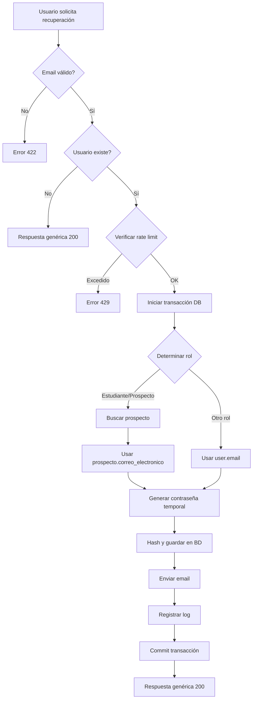

# 🔐 Sistema de Recuperación de Contraseña

## 📋 Descripción General

Sistema completo de recuperación segura de contraseñas implementado para el backend de ASMProlink usando Laravel Sanctum. Permite a los usuarios recuperar el acceso a su cuenta mediante la generación y envío de una contraseña temporal por correo electrónico.

---

## 🎯 Características Principales

### ✅ Funcionalidades Implementadas

1. **Endpoint Público**: `/api/password/recover`
2. **Rate Limiting**: 1 solicitud por hora por IP
3. **Contraseñas Seguras**: Generación automática de 8 caracteres (mayúsculas, minúsculas, números, especiales)
4. **Email Dinámico**: Determina automáticamente el destinatario según el rol del usuario
5. **Logging Completo**: Registro de todos los intentos (éxito/fallo)
6. **Prevención de Enumeración**: Respuesta genérica sin revelar si el email existe
7. **Transacciones DB**: Rollback automático en caso de error

---

## 📊 Arquitectura del Sistema

### Componentes Creados

```
📁 app/
├── 📁 Http/Controllers/Api/
│   └── PasswordRecoveryController.php    # Lógica principal
├── 📁 Mail/
│   └── TemporaryPasswordMail.php         # Mailable del email
└── 📁 Models/
    └── PasswordResetLog.php              # Modelo de logs

📁 database/migrations/
└── 2025_10_24_135345_create_password_reset_logs_table.php

📁 resources/views/emails/
└── temporary-password.blade.php          # Template HTML del email

📁 routes/
└── api.php                                # Ruta pública registrada
```

---

## 🗄️ Base de Datos

### Tabla: `password_reset_logs`

```sql
CREATE TABLE password_reset_logs (
    id BIGSERIAL PRIMARY KEY,
    user_id BIGINT NOT NULL,
    email_destino VARCHAR(100) NOT NULL,
    ip_address VARCHAR(45) NULL,
    user_agent VARCHAR(255) NULL,
    status VARCHAR(20) DEFAULT 'pending',
    reset_method VARCHAR(50) DEFAULT 'temporary_password',
    notes TEXT NULL,
    created_at TIMESTAMP DEFAULT CURRENT_TIMESTAMP,
    updated_at TIMESTAMP NULL,
    
    FOREIGN KEY (user_id) REFERENCES users(id) ON DELETE CASCADE,
    INDEX idx_user_id (user_id),
    INDEX idx_email_destino (email_destino),
    INDEX idx_ip_address (ip_address),
    INDEX idx_status (status),
    INDEX idx_created_at (created_at)
);
```

**Campos:**
- `user_id`: Usuario que solicitó la recuperación
- `email_destino`: Email donde se envió la contraseña temporal
- `ip_address`: IP del cliente que hizo la solicitud
- `user_agent`: Navegador/cliente usado
- `status`: `success`, `failed`, `pending`
- `reset_method`: Método usado (`temporary_password`, `reset_link`)
- `notes`: Información adicional/errores

---

## 🚀 Uso del Endpoint

### Request

**URL:** `POST /api/password/recover`

**Headers:**
```http
Content-Type: application/json
Accept: application/json
```

**Body:**
```json
{
  "email": "usuario@ejemplo.com"
}
```

### Responses

#### ✅ Éxito (200)
```json
{
  "success": true,
  "message": "Si el correo electrónico está registrado, recibirás un email con tu nueva contraseña temporal."
}
```

#### ❌ Validación Fallida (422)
```json
{
  "success": false,
  "message": "El correo electrónico proporcionado no es válido.",
  "errors": {
    "email": ["El campo email es obligatorio."]
  }
}
```

#### ❌ Error del Servidor (500)
```json
{
  "success": false,
  "message": "Ocurrió un error al procesar la solicitud. Por favor, inténtalo de nuevo."
}
```

#### 🚫 Rate Limit Excedido (429)
```json
{
  "message": "Too Many Requests"
}
```

---

## 🔐 Seguridad Implementada

### 1. **Rate Limiting**
- **Configuración**: 1 solicitud por hora por IP
- **Middleware**: `throttle:1,60`
- **Protección**: Previene ataques de fuerza bruta

### 2. **Prevención de Enumeración de Emails**
- Respuesta **idéntica** si el email existe o no existe
- No revela información sobre usuarios registrados
- Protege la privacidad de los usuarios

### 3. **Generación de Contraseñas Seguras**

**Algoritmo:**
```php
// 8 caracteres con:
// - Al menos 1 mayúscula
// - Al menos 1 minúscula
// - Al menos 1 número
// - Al menos 1 carácter especial (!@#$%&*)
// - Caracteres mezclados aleatoriamente
```

**Ejemplo de contraseña generada:** `A9k#mP2x`

### 4. **Hashing de Contraseñas**
```php
$user->password = Hash::make($temporaryPassword);
```
- Usa bcrypt por defecto
- No se almacenan contraseñas en texto plano

### 5. **Logging de Actividad**
- Todos los intentos se registran (éxito/fallo)
- Incluye IP y user agent
- Permite auditoría de seguridad

---

## 📧 Sistema de Emails

### Determinación del Destinatario

**Lógica:**
```php
1. Verificar rol del usuario:
   - Si es "Estudiante" o "Prospecto":
     → Buscar prospecto por carnet
     → Usar prospecto.correo_electronico
   
   - Otros roles:
     → Usar user.email

2. Fallback:
   - Si no hay prospecto → user.email
   - Si no hay email disponible → Registrar error
```

### Template del Email

**Archivo:** `resources/views/emails/temporary-password.blade.php`

**Características:**
- ✅ Diseño responsivo
- ✅ Branding institucional (ASMProlink)
- ✅ Contraseña visible en formato destacado
- ✅ Instrucciones claras de uso
- ✅ Avisos de seguridad
- ✅ Estilo profesional con CSS inline

**Variables disponibles:**
- `$userName`: Nombre completo del usuario
- `$temporaryPassword`: Contraseña temporal generada
- `$carnet`: Carnet del estudiante (opcional)

---

## 🔍 Logging y Auditoría

### Logs en Laravel Log

**Ejemplo de log exitoso:**
```
🔐 [PASSWORD RECOVERY] Solicitud recibida
   email: usuario@ejemplo.com
   ip: 192.168.1.100
   user_agent: Mozilla/5.0...

🔍 [PASSWORD RECOVERY] Determinando email destino
   user_id: 123
   role: Estudiante
   carnet: 20240001

📮 [PASSWORD RECOVERY] Usando correo del prospecto
   carnet: 20240001
   email: estudiante@correo.com

🔑 [PASSWORD RECOVERY] Contraseña temporal generada
   user_id: 123
   email_destino: estudiante@correo.com
   password_length: 8

💾 [PASSWORD RECOVERY] Contraseña actualizada en BD
   user_id: 123

📧 [PASSWORD RECOVERY] Email enviado exitosamente
   user_id: 123
   email_destino: estudiante@correo.com
   user_name: Juan Pérez

📝 [PASSWORD RECOVERY] Log guardado
   user_id: 123
   status: success

✅ [PASSWORD RECOVERY] Proceso completado exitosamente
   user_id: 123
   email_destino: estudiante@correo.com
```

### Logs en Base de Datos

**Query para consultar intentos:**
```sql
-- Todos los intentos de un usuario
SELECT * FROM password_reset_logs 
WHERE user_id = 123 
ORDER BY created_at DESC;

-- Intentos fallidos en las últimas 24 horas
SELECT * FROM password_reset_logs 
WHERE status = 'failed' 
  AND created_at >= NOW() - INTERVAL '24 hours';

-- Intentos por IP
SELECT ip_address, COUNT(*) as intentos, 
       SUM(CASE WHEN status = 'success' THEN 1 ELSE 0 END) as exitosos,
       SUM(CASE WHEN status = 'failed' THEN 1 ELSE 0 END) as fallidos
FROM password_reset_logs 
GROUP BY ip_address 
ORDER BY intentos DESC;
```

---

## 🧪 Testing

### Con Postman

**1. Solicitud Exitosa:**
```http
POST http://localhost:8000/api/password/recover
Content-Type: application/json

{
  "email": "estudiante@ejemplo.com"
}
```

**Verificar:**
- ✅ Respuesta HTTP 200
- ✅ Email recibido con contraseña temporal
- ✅ Login funciona con nueva contraseña
- ✅ Registro en `password_reset_logs`

**2. Email No Registrado:**
```http
POST http://localhost:8000/api/password/recover
Content-Type: application/json

{
  "email": "noencontrado@ejemplo.com"
}
```

**Verificar:**
- ✅ Respuesta HTTP 200 (misma que caso exitoso)
- ✅ No se envía email
- ✅ Log de advertencia en Laravel

**3. Rate Limiting:**
```http
# Primera solicitud → 200 OK
POST http://localhost:8000/api/password/recover
{
  "email": "usuario@ejemplo.com"
}

# Segunda solicitud inmediata → 429 Too Many Requests
POST http://localhost:8000/api/password/recover
{
  "email": "usuario@ejemplo.com"
}
```

**4. Validación:**
```http
POST http://localhost:8000/api/password/recover
Content-Type: application/json

{
  "email": "email-invalido"
}
```

**Verificar:**
- ✅ Respuesta HTTP 422
- ✅ Mensaje de error de validación

---

## 🛠️ Configuración SMTP

**Archivo:** `.env`

```env
MAIL_MAILER=smtp
MAIL_HOST=mail.tecnoferia.lat
MAIL_PORT=587
MAIL_USERNAME=certificados@mail.tecnoferia.lat
MAIL_PASSWORD=tu_contraseña_smtp
MAIL_ENCRYPTION=tls
MAIL_FROM_ADDRESS=certificados@mail.tecnoferia.lat
MAIL_FROM_NAME="ASMProlink Sistema"
```

**Verificar configuración:**
```bash
php artisan config:cache
php artisan config:clear
```

---

## 📝 Casos de Uso

### Caso 1: Estudiante Olvidó su Contraseña

**Flujo:**
1. Estudiante va a pantalla de recuperación
2. Ingresa su email de usuario: `juan.estudiante@gmail.com`
3. Sistema busca usuario por email
4. Detecta rol "Estudiante"
5. Busca prospecto con carnet del usuario
6. Envía contraseña temporal a `juan.perez@correo.edu.gt` (email del prospecto)
7. Estudiante revisa su correo institucional
8. Inicia sesión con contraseña temporal
9. Cambia contraseña en su perfil

### Caso 2: Administrador Olvidó su Contraseña

**Flujo:**
1. Admin va a pantalla de recuperación
2. Ingresa: `admin@asmprolink.com`
3. Sistema detecta rol "Administrador"
4. Envía contraseña temporal directamente a `admin@asmprolink.com`
5. Admin inicia sesión y cambia contraseña

### Caso 3: Intento de Ataque

**Flujo:**
1. Atacante intenta enumerar usuarios
2. Envía múltiples solicitudes con emails aleatorios
3. Rate limiter bloquea después de 1 solicitud
4. Atacante recibe HTTP 429 (Too Many Requests)
5. Sistema registra todos los intentos con IP
6. Administrador puede revisar logs sospechosos

---

## 🚨 Troubleshooting

### Problema 1: Email No Llega

**Diagnóstico:**
```bash
# Verificar configuración SMTP
php artisan config:show mail

# Probar envío manual
php artisan tinker
>>> Mail::raw('Test', function($message) {
      $message->to('test@ejemplo.com')->subject('Test');
    });
```

**Soluciones:**
- Verificar credenciales SMTP en `.env`
- Revisar firewall/puertos
- Verificar logs: `storage/logs/laravel.log`

### Problema 2: Rate Limiting No Funciona

**Diagnóstico:**
```bash
# Verificar cache de rutas
php artisan route:cache
php artisan route:clear

# Verificar middleware en ruta
php artisan route:list --name=password.recover
```

### Problema 3: Error al Generar Contraseña

**Síntoma:** Error 500 al solicitar recuperación

**Solución:**
```bash
# Verificar extensión PHP random_int
php -m | grep random

# Verificar permisos de escritura
ls -la storage/logs/
```

---

## 📦 Archivos del Sistema

### PasswordRecoveryController.php

**Métodos principales:**

| Método | Descripción |
|--------|-------------|
| `recover()` | Punto de entrada principal, maneja la solicitud |
| `determineDestinationEmail()` | Determina email destino según rol |
| `generateSecurePassword()` | Genera contraseña aleatoria de 8 caracteres |
| `getUserName()` | Obtiene nombre para personalizar email |
| `logRecoveryAttempt()` | Registra intento en base de datos |

### PasswordResetLog.php

**Relaciones:**
```php
// Obtener usuario de un log
$log->user;

// Obtener logs de un usuario
$user->passwordResetLogs;
```

### TemporaryPasswordMail.php

**Uso manual:**
```php
use App\Mail\TemporaryPasswordMail;
use Illuminate\Support\Facades\Mail;

Mail::to('usuario@ejemplo.com')
    ->send(new TemporaryPasswordMail(
        'Juan Pérez',
        'A9k#mP2x',
        '20240001'
    ));
```

---

## 🔄 Flujo Completo del Sistema



---

## 📊 Estadísticas y Métricas

### Queries Útiles para Administración

```sql
-- Total de recuperaciones por mes
SELECT 
    DATE_TRUNC('month', created_at) as mes,
    COUNT(*) as total_intentos,
    SUM(CASE WHEN status = 'success' THEN 1 ELSE 0 END) as exitosos
FROM password_reset_logs
GROUP BY DATE_TRUNC('month', created_at)
ORDER BY mes DESC;

-- Usuarios con más intentos de recuperación
SELECT 
    u.id,
    u.email,
    u.carnet,
    COUNT(prl.id) as intentos
FROM users u
INNER JOIN password_reset_logs prl ON u.id = prl.user_id
GROUP BY u.id, u.email, u.carnet
HAVING COUNT(prl.id) > 3
ORDER BY intentos DESC;

-- IPs sospechosas (muchos intentos)
SELECT 
    ip_address,
    COUNT(*) as intentos,
    COUNT(DISTINCT user_id) as usuarios_diferentes
FROM password_reset_logs
WHERE created_at >= NOW() - INTERVAL '7 days'
GROUP BY ip_address
HAVING COUNT(*) > 5
ORDER BY intentos DESC;
```

---

## ✅ Checklist de Implementación

- [x] Migración de base de datos creada
- [x] Modelo `PasswordResetLog` implementado
- [x] Controlador `PasswordRecoveryController` creado
- [x] Mailable `TemporaryPasswordMail` implementado
- [x] Template HTML del email diseñado
- [x] Ruta pública registrada en `api.php`
- [x] Rate limiting configurado (1/hora)
- [x] Logging completo implementado
- [x] Transacciones DB añadidas
- [x] Prevención de enumeración de emails
- [x] Generación de contraseñas seguras
- [x] Determinación dinámica de email destino
- [x] Relaciones de modelos configuradas
- [x] Índices de base de datos optimizados
- [x] Documentación completa creada

---

## 🔮 Mejoras Futuras (Opcionales)

### 1. **Link de Recuperación con Token**
```php
// En lugar de contraseña temporal, enviar link con token
$token = Str::random(64);
$resetLink = url("/reset-password?token={$token}");
```

### 2. **Expiración de Contraseñas Temporales**
```php
// Añadir campo temp_password_expires_at en users
$user->temp_password_expires_at = now()->addHours(24);
```

### 3. **Notificación de Cambio de Contraseña**
```php
// Enviar email de confirmación después de recuperación exitosa
Mail::to($user->email)->send(new PasswordChangedNotification());
```

### 4. **Dashboard de Auditoría**
- Panel administrativo para ver intentos
- Gráficas de intentos por fecha
- Alertas de actividad sospechosa

### 5. **Verificación en Dos Pasos**
```php
// Requerir código adicional enviado por SMS o email
$verificationCode = rand(100000, 999999);
```

---

## 📞 Soporte

**Desarrollado por:** GitHub Copilot Assistant  
**Fecha:** 24 de Octubre, 2025  
**Sistema:** ASMProlink Backend - Laravel 10.x  

**Contacto:** Administrador del sistema

---

## 📄 Licencia

Este sistema es parte del proyecto ASMProlink. Uso interno exclusivo.

© 2025 ASMProlink. Todos los derechos reservados.
